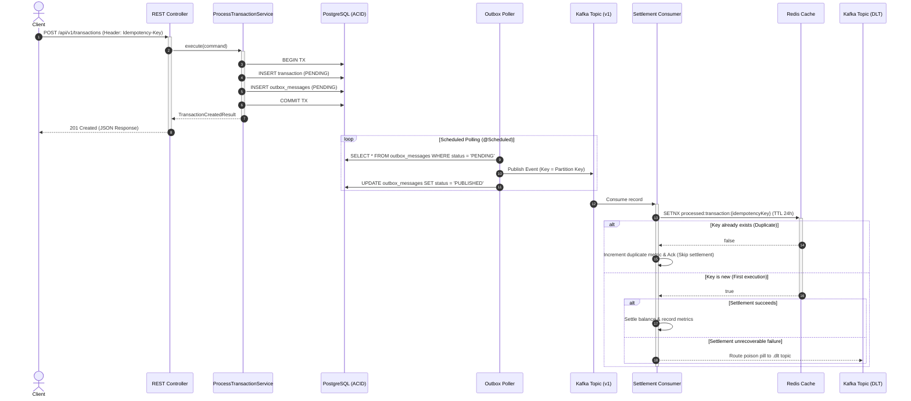

```powershell
Set-Content -Path README.md -Value @'
# Financial Transaction Engine

High-throughput, resilient financial transaction engine built with **Java 24**, **Spring Boot 3.3**, and **Apache Kafka**. Designed following **Domain-Driven Design (DDD)** and **Hexagonal Architecture (Ports & Adapters)** principles.

---

## Architectural Patterns & Key Features

* **Hexagonal Architecture & DDD:** Strict decoupling between core domain logic, use case ports, and infrastructure adapters (REST, Postgres, Kafka, Redis).
* **Transactional Outbox Pattern:** Ensures dual-write consistency between PostgreSQL persistence and Kafka message dispatch without requiring distributed 2PC transactions.
* **Distributed Deduplication (Idempotency):** Atomic deduplication using Redis (`SETNX` with TTL) at the consumer level to guarantee exact-once settlement semantics over an at-least-once transport.
* **Resilience & Dead Letter Topic (DLT):** Configured with `DefaultErrorHandler`, selective backoff retry policies, and non-retryable exception routing to `financial.transactions.v1.dlt`.
* **Observability:** Custom domain metrics tracked via Micrometer and exposed for Prometheus scraping (`/actuator/prometheus`).
* **Database Migrations:** Versioned relational schema managed with Flyway.
* **Containerization:** Multi-stage Docker build with automated service orchestration via Docker Compose.

---

## Architecture & Data Flow



---

## Tech Stack

| Component | Technology | Version |
| --- | --- | --- |
| **Language** | Java | 24 |
| **Framework** | Spring Boot | 3.3.3 |
| **Messaging** | Apache Kafka (KRaft mode) | 3.7.1 |
| **Database** | PostgreSQL | 16 |
| **Migrations** | Flyway | 10.10.0 |
| **In-Memory Cache** | Redis | 7.0 |
| **Metrics & Observability** | Micrometer / Prometheus | Actuator |
| **Containerization** | Docker / Docker Compose | Multi-stage |

---

## API Specification

### 1. Create Transaction

* **Method:** `POST`
* **Path:** `/api/v1/transactions`
* **Header:** `Idempotency-Key: <String | UUID>` (Required)

**Request Body:**

```json
{
  "sourceAccountId": "11111111-1111-1111-1111-111111111111",
  "destinationAccountId": "22222222-2222-2222-2222-222222222222",
  "amount": 5000.00,
  "currency": "USD"
}

```

**Response (201 Created):**

```json
{
  "status": "PENDING",
  "idempotencyKey": "TX-DOCKER-LIVE-001",
  "transactionId": "0da35818-af11-46a4-ba11-4c07ae844c8d"
}

```

---

### 2. Prometheus Metrics

* **Method:** `GET`
* **Path:** `/actuator/prometheus`

**Exposed Business Metrics:**

* `transactions_processed_total`: Number of transactions successfully settled.
* `transactions_duplicates_total`: Number of duplicate events discarded via Redis.
* `transactions_dlt_total`: Number of failed events routed to the Dead Letter Topic.
* `transactions_volume_total`: Cumulative monetary amount processed by currency.

---

## Project Structure (Hexagonal Architecture)

```text
com.engine.financial_transaction_engine
├── domain
│   ├── exception
│   └── model
│       ├── Transaction.java
│       ├── TransactionId.java
│       ├── Money.java
│       └── TransactionStatus.java
├── application
│   ├── port
│   │   ├── in
│   │   │   ├── ProcessTransactionUseCase.java
│   │   │   └── ProcessTransactionCommand.java
│   │   └── out
│   │       ├── TransactionRepositoryPort.java
│   │       └── OutboxRepositoryPort.java
│   └── service
│       └── ProcessTransactionService.java
└── infrastructure
    ├── adapter
    │   ├── in
    │   │   ├── rest
    │   │   │   ├── TransactionController.java
    │   │   │   └── GlobalExceptionHandler.java
    │   │   └── kafka
    │   │       └── TransactionCreatedEventHandler.java
    │   └── out
    │       ├── persistence
    │       │   ├── TransactionJpaEntity.java
    │       │   ├── OutboxEntity.java
    │       │   └── PostgresTransactionRepository.java
    │       ├── kafka
    │       │   └── OutboxPublisher.java
    │       └── metrics
    │           └── TransactionMetrics.java
    └── config
        ├── KafkaConfig.java
        ├── RedisConfig.java
        └── MetricsConfig.java

```

---

## How to Run

### Run Full Infrastructure (Docker Compose)

```bash
docker compose up -d --build

```

### View Application Logs

```bash
docker logs -f transaction-engine-app

```

### Stop All Services

```bash
docker compose down

```

'@ -Encoding utf8

```

Ese comando creará directamente el archivo `README.md` con la codificación UTF-8 correcta en la carpeta raíz del proyecto.

```